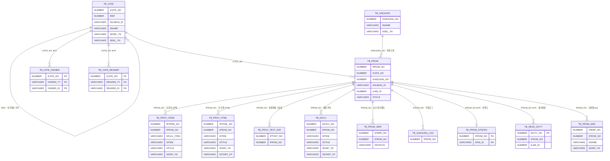
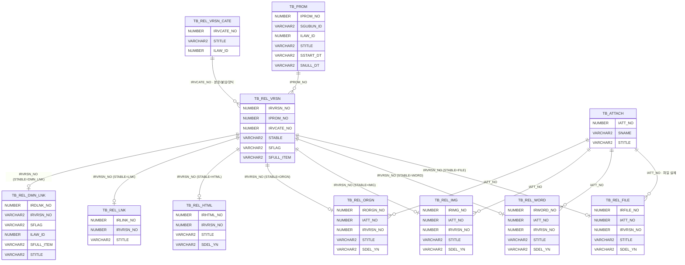
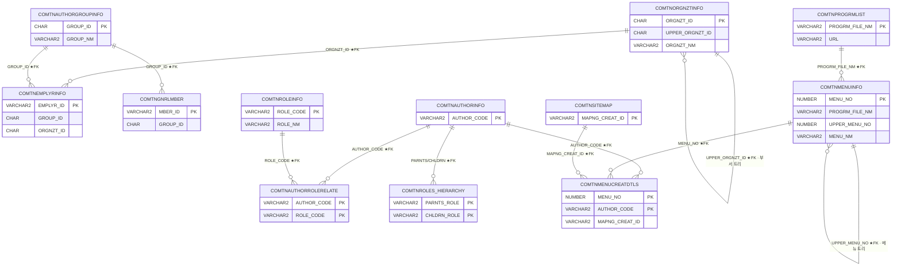
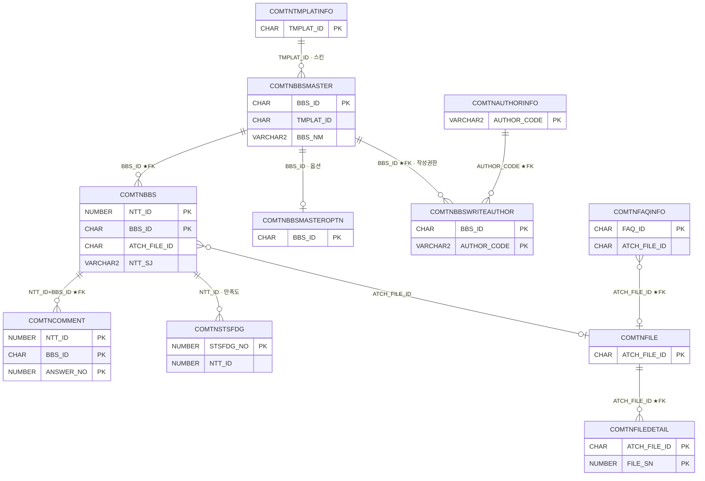
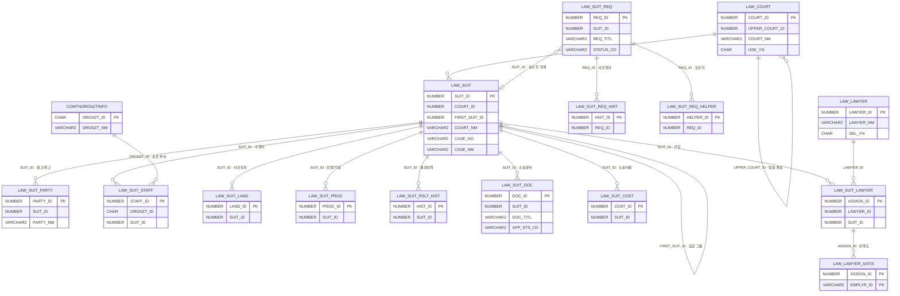
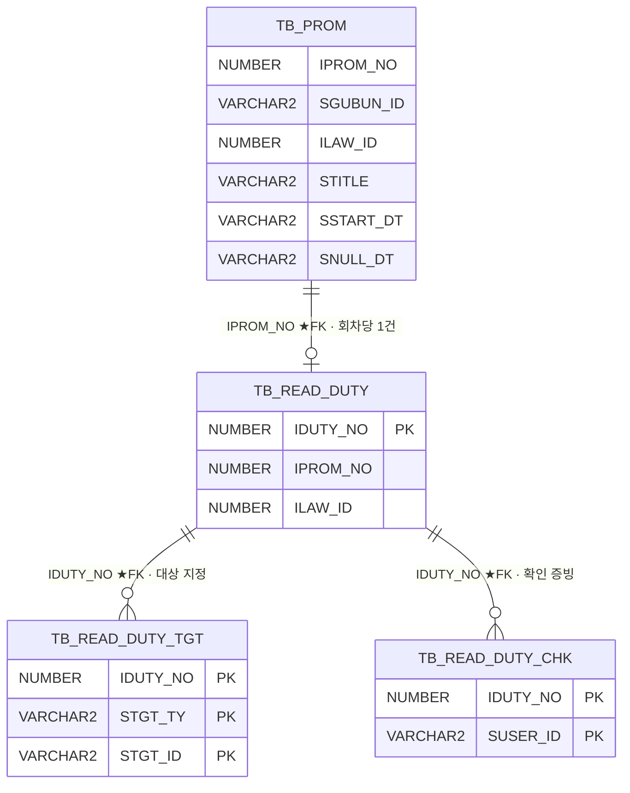

# RLMS — 핵심 기능 ERD

> 자동 생성물(`database/newdb` DDL 기준). 관계 라벨의 **★FK** 는 DB 에 FK 제약이 실제로 걸린 관계, 나머지는 **애플리케이션이 보장하는 논리 관계**다.  
> 전체 컬럼은 [테이블 명세서](테이블_명세서.md) 참고.

> ⚠️ 이 스키마는 FK 제약이 26건뿐이다(레거시 이관분은 FK 없음). 따라서 **DB 가 참조무결성을 지켜주지 않는다** — 삭제·이동 로직은 반드시 서비스 계층에서 연쇄 처리를 확인할 것.

---

## 1. 규정·조문 코어

분류(TB_CATE) 아래에 규정 회차(TB_PROM)가 달리고, 회차 1건이 조문·별표·이력을 소유한다. 같은 규정의 여러 회차는 `ILAW_ID` 로 묶이며(회차 그룹), 현행 회차는 시행일(`SSTART_DT`)·폐지일(`SNULL_DT`)로 판정한다.

| 테이블 | 설명 |
|---|---|
| [`TB_CATE`](테이블_명세서.md#tb-cate) | 규정 분류 트리 — 자기참조(IREF) + 비정규화 조상경로(IREF_LV_1~10) |
| [`TB_PROM`](테이블_명세서.md#tb-prom) | 규정 회차(공포) 마스터 — 법령/사규 등 규정의 제·개정 회차 단위 행 |
| [`TB_CATE_OWNER`](테이블_명세서.md#tb-cate-owner) | 분류별 작성자(소유) 매핑 — 부서/개인 N명 |
| [`TB_CATE_READER`](테이블_명세서.md#tb-cate-reader) | 분류별 열람제한 매핑 - 지정 시 해당 부서/개인만 열람, 미지정=전체 공개 |
| [`TB_GAEJUNG`](테이블_명세서.md#tb-gaejung) | 개정구분 마스터 (제정/일부개정/폐지 등) |
| [`TB_PROV_VRSN`](테이블_명세서.md#tb-prov-vrsn) | 조문 버전(단위 행) — 본문을 조/항/호 단위로 분해 저장, SFULL_ITEM 으로 회차간 비교 |
| [`TB_PROV_HTML`](테이블_명세서.md#tb-prov-html) | 조문 HTML 본문 — 회차별 조 단위 본문 1행 (저장 시 TB_PROV_VRSN 으로 분해) |
| [`TB_PROV_TEXT_HST`](테이블_명세서.md#tb-prov-text-hst) | 회차 본문 일괄편집 이력 — 일괄저장 직전 본문 텍스트 스냅샷 |
| [`TB_DOCU`](테이블_명세서.md#tb-docu) | 별표/별지서식 — 회차(IPROM_NO) 단위 누적(변경분만 저장) 모델 |
| [`TB_PROM_WRK`](테이블_명세서.md#tb-prom-wrk) | 규정 승인 워크플로 — 회차별 상태(편집중/승인요청/승인완료 등) 이력 행 |
| [`TB_GAEJUNG_LOG`](테이블_명세서.md#tb-gaejung-log) | 규정 등록·수정 작업 로그 — 회차 저장 시점에 자동 1행 기록 |
| [`TB_PROM_STSFDG`](테이블_명세서.md#tb-prom-stsfdg) | — |
| [`TB_READ_DUTY`](테이블_명세서.md#tb-read-duty) | 필수 열람 지정 — 승인 회차에 열람 의무 대상(전사/부서/개인) 지정, 회차당 1건 |
| [`TB_PROM_MAP`](테이블_명세서.md#tb-prom-map) | 규정맵(기능별분류) 트리 — 폴더(SPROM_YN=N)와 규정 leaf(SPROM_YN=Y), IREF 자기참조 |

---

## 2. 관련자료(8액션) 허브-상세 구조

`TB_REL_VRSN` 이 허브다. 자료 1건 = 허브 1행이고, `STABLE` 값이 실제 상세 테이블을 가리킨다(FILE/WORD/IMG/ORGN/HTML/LNK/DMN_LNK). 파일 실체는 `TB_ATTACH` 가 보관한다.

| 테이블 | 설명 |
|---|---|
| [`TB_PROM`](테이블_명세서.md#tb-prom) | 규정 회차(공포) 마스터 — 법령/사규 등 규정의 제·개정 회차 단위 행 |
| [`TB_REL_VRSN`](테이블_명세서.md#tb-rel-vrsn) | 관련자료 마스터(허브) — 회차/조문에 붙은 자료 1건=1행, STABLE 이 실제 상세 테이블 |
| [`TB_REL_VRSN_CATE`](테이블_명세서.md#tb-rel-vrsn-cate) | 관련자료 카테고리(본문/붙임/양식 등) — 회차+법령 단위 그룹 헤더 |
| [`TB_REL_FILE`](테이블_명세서.md#tb-rel-file) | 관련자료 — 일반 파일 상세 |
| [`TB_REL_WORD`](테이블_명세서.md#tb-rel-word) | 관련자료 — 워드/HWP 문서 상세 (HTML 변환본 보관) |
| [`TB_REL_IMG`](테이블_명세서.md#tb-rel-img) | 관련자료 — 이미지 첨부 상세 |
| [`TB_REL_ORGN`](테이블_명세서.md#tb-rel-orgn) | 관련자료 — 원본(정본) 파일 상세, 다운로드 허용은 카테고리 SORGNDOWN_YN 정책으로 통제 |
| [`TB_REL_HTML`](테이블_명세서.md#tb-rel-html) | 관련자료 — 직접작성 HTML 표/본문 상세 |
| [`TB_REL_LNK`](테이블_명세서.md#tb-rel-lnk) | 관련자료 — 외부 URL 링크 상세 |
| [`TB_REL_DMN_LNK`](테이블_명세서.md#tb-rel-dmn-lnk) | 관련자료 — 규정/조문 연계(DOMAIN_LINK) 상세 |
| [`TB_ATTACH`](테이블_명세서.md#tb-attach) | 도메인 첨부파일 — SREF_TABLE+IREF_NO 다형 참조 (BBS/팝업 등 표준모듈은 COMTNFILE 사용) |

---

## 3. 사용자·권한·메뉴 (URL 인가 원천)

로그인 정본은 뷰 `COMVNUSERMASTER`(일반회원 + 업무사용자 UNION). URL 접근제어의 단일 원천은 **메뉴(COMTNMENUINFO) ↔ 프로그램(COMTNPROGRMLIST) ↔ 메뉴별 권한(COMTNMENUCREATDTLS)** 이다. 신규 화면을 추가하면 프로그램·메뉴·메뉴별권한을 반드시 함께 등록해야 접근이 열린다.

| 테이블 | 설명 |
|---|---|
| [`COMTNORGNZTINFO`](테이블_명세서.md#comtnorgnztinfo) | 조직정보 |
| [`COMTNEMPLYRINFO`](테이블_명세서.md#comtnemplyrinfo) | 업무사용자정보 |
| [`COMTNAUTHORGROUPINFO`](테이블_명세서.md#comtnauthorgroupinfo) | 권한그룹정보 |
| [`COMTNGNRLMBER`](테이블_명세서.md#comtngnrlmber) | 일반회원 |
| [`COMTNAUTHORINFO`](테이블_명세서.md#comtnauthorinfo) | 권한정보 |
| [`COMTNAUTHORROLERELATE`](테이블_명세서.md#comtnauthorrolerelate) | 권한롤관계 |
| [`COMTNROLEINFO`](테이블_명세서.md#comtnroleinfo) | 롤정보 |
| [`COMTNROLES_HIERARCHY`](테이블_명세서.md#comtnroles-hierarchy) | 롤 계층구조 |
| [`COMTNMENUCREATDTLS`](테이블_명세서.md#comtnmenucreatdtls) | 메뉴생성내역 |
| [`COMTNMENUINFO`](테이블_명세서.md#comtnmenuinfo) | 메뉴정보 |
| [`COMTNPROGRMLIST`](테이블_명세서.md#comtnprogrmlist) | 프로그램목록 |
| [`COMTNSITEMAP`](테이블_명세서.md#comtnsitemap) | 사이트맵 |

---

## 4. 게시판·첨부(표준 모듈)

게시판은 eGov 표준을 그대로 쓴다. 첨부는 `COMTNFILE`(묶음) + `COMTNFILEDETAIL`(개별 파일) 2단 구조이며, 게시글은 `ATCH_FILE_ID` 로 묶음을 참조한다. 규정 도메인 첨부만 `TB_ATTACH` 를 쓴다.

| 테이블 | 설명 |
|---|---|
| [`COMTNTMPLATINFO`](테이블_명세서.md#comtntmplatinfo) | 템플릿 |
| [`COMTNBBSMASTER`](테이블_명세서.md#comtnbbsmaster) | 게시판마스터 |
| [`COMTNBBS`](테이블_명세서.md#comtnbbs) | 게시판 |
| [`COMTNBBSMASTEROPTN`](테이블_명세서.md#comtnbbsmasteroptn) | 게시판마스터옵션 |
| [`COMTNBBSWRITEAUTHOR`](테이블_명세서.md#comtnbbswriteauthor) | 게시판작성권한 |
| [`COMTNAUTHORINFO`](테이블_명세서.md#comtnauthorinfo) | 권한정보 |
| [`COMTNCOMMENT`](테이블_명세서.md#comtncomment) | 댓글 |
| [`COMTNSTSFDG`](테이블_명세서.md#comtnstsfdg) | 만족도 |
| [`COMTNFILE`](테이블_명세서.md#comtnfile) | 파일속성 |
| [`COMTNFILEDETAIL`](테이블_명세서.md#comtnfiledetail) | 파일상세정보 |
| [`COMTNFAQINFO`](테이블_명세서.md#comtnfaqinfo) | FAQ정보 |

---

## 5. 송무 — 사건 중심 구조

`LAW_SUIT` 이 **심급 1건 = 1행**이다. 1심·2심·3심은 별도 행이며 `FIRST_SUIT_ID` 로 사건군을 묶는다. 사용자가 올린 소송의뢰(`LAW_SUIT_REQ`)는 승인 후 `SUIT_ID` 로 사건에 연결된다. 첨부는 표준 `COMTNFILE`(ATCH_FILE_ID)을 쓴다.

| 테이블 | 설명 |
|---|---|
| [`LAW_SUIT`](테이블_명세서.md#law-suit) | 송무 사건 마스터 — 심급 단위 1행, 사건군 그룹핑은 FIRST_SUIT_ID(§4.5) |
| [`LAW_COURT`](테이블_명세서.md#law-court) | 송무 법원 마스터 (계층 — 루트 COURT_ID=0). 대표 시드 22행, 부족분은 운영 등록 |
| [`LAW_SUIT_PARTY`](테이블_명세서.md#law-suit-party) | 송무 사건 당사자 (원고/피고/보조참가인) |
| [`LAW_SUIT_STAFF`](테이블_명세서.md#law-suit-staff) | 송무 사건 소송수행자 (부서=표준 COMTNORGNZTINFO 연동 — 레거시 김해 부서코드 A33 폐기) |
| [`LAW_SUIT_LAND`](테이블_명세서.md#law-suit-land) | 송무 사건토지 (행 단위 정규화 — 사건지번표시도(Kakao Geocoder) 원천).CASE_LAND_* |
| [`LAW_SUIT_PROG`](테이블_명세서.md#law-suit-prog) | 송무 진행상황·기일 겸용 — 소송등록 진행상황 그리드와 일정관리(달력)가 같은 테이블(§7.5) |
| [`LAW_SUIT_RSLT_HIST`](테이블_명세서.md#law-suit-rslt-hist) | 송무 결과변경 이력 — 결과 필드만 이력화(레거시 전체 스냅샷 폐지) |
| [`LAW_SUIT_DOC`](테이블_명세서.md#law-suit-doc) | 송무 소송문서 — 첨부=표준 COMTNFILE/COMTNFILEDETAIL(다중), 등록=승인대기·수정 시 대기 리셋(§7.2) |
| [`LAW_SUIT_COST`](테이블_명세서.md#law-suit-cost) | 송무 소송비용 (단일행 — 레거시 신청/지급 2테이블 통합) |
| [`LAW_SUIT_LAWYER`](테이블_명세서.md#law-suit-lawyer) | 송무 선임 (사건×변호사) — 만족도 평가 대상 단위(§4.3) |
| [`LAW_LAWYER`](테이블_명세서.md#law-lawyer) | 송무 변호사 명부 — 법무법인은 텍스트(마스터 비범위 §1.2) |
| [`LAW_LAWYER_SATIS`](테이블_명세서.md#law-lawyer-satis) | 송무 법무법인 만족도(간이 별점+의견) — 평가 대상=선임(사건×변호사) 단위, 1인 1회 MERGE(TB_PROM_STSFDG 패턴).2) |
| [`LAW_SUIT_REQ`](테이블_명세서.md#law-suit-req) | 송무 소송의뢰 — 사용자(front) 신청, 법무팀 승인/반려, 승인 후 소송등록 연계(§7.8·7.9) |
| [`LAW_SUIT_REQ_HIST`](테이블_명세서.md#law-suit-req-hist) | 송무 소송의뢰 사건경과 내역 (행별 첨부 1건) |
| [`LAW_SUIT_REQ_HELPER`](테이블_명세서.md#law-suit-req-helper) | 송무 소송의뢰 수행 보조자 (부서명은 자유 텍스트 — 외부 인원 허용) |
| [`COMTNORGNZTINFO`](테이블_명세서.md#comtnorgnztinfo) | 조직정보 |

---

## 6. 필수 열람(의무 숙지)

승인된 회차에 열람 의무를 지정하고(전사/부서/개인), 2단계(열람 자동기록 → 숙지 확인 버튼)로 증빙을 남긴다.

| 테이블 | 설명 |
|---|---|
| [`TB_PROM`](테이블_명세서.md#tb-prom) | 규정 회차(공포) 마스터 — 법령/사규 등 규정의 제·개정 회차 단위 행 |
| [`TB_READ_DUTY`](테이블_명세서.md#tb-read-duty) | 필수 열람 지정 — 승인 회차에 열람 의무 대상(전사/부서/개인) 지정, 회차당 1건 |
| [`TB_READ_DUTY_TGT`](테이블_명세서.md#tb-read-duty-tgt) | 필수 열람 대상 행 — DEPT(부서)/USER(개인) 혼합 지정 (TB_CATE_READER 패턴) |
| [`TB_READ_DUTY_CHK`](테이블_명세서.md#tb-read-duty-chk) | 필수 열람 확인 — 2단계(열람 자동/숙지 버튼), 증빙 영구 보존 |

